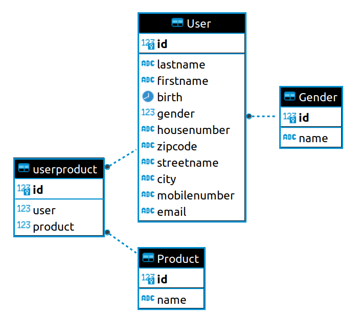
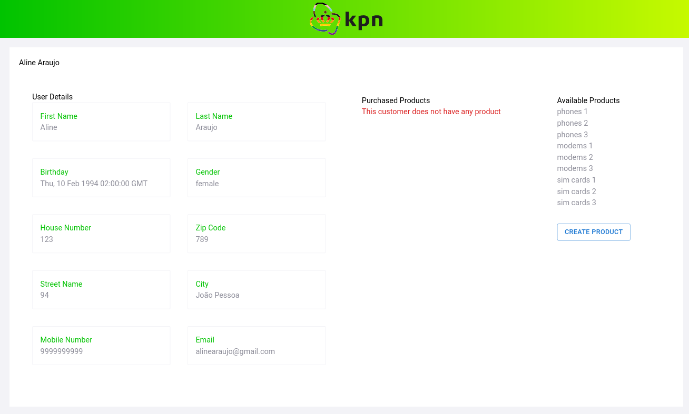

# KPN Assignment test

Details about the test can be found [here](./readme_files/KPN_Technical_Assignment_v2.pdf)

# Disclaimers

Due to a lack of time, I have made some decisions that can be judged wrong, but I would like you to know that I am aware of them. For example:

- I would like to work more on the architecture. I end up doing too much stuff in a single file. Which is not so good while reading the document;

- There are some tests I would write given more time;

- Security: I'm not handling authentication at the moment

# How to configure the environment

## Database

I decided to implement the database with postgress

## Backend

The backend I wrote in python and flask and SQLAlchemy as ORM

## Frontend

The frontend I wrote in react, since it's the framework I have more knowledge.
To complement the framework I used:

- React router dom
- Material UI
- typescript
- vite
- axios
- tailwindcss

# How to run it

# TODO

## Backend

    [x] Create ERD of the database
    [x] Init backend folder
    [x] Init database with ORM (SQLAlchemy)
    [x] Script to start the database
    [] Backend Tests
    [] Document installation process and how to run
    [] Run in docker
    [x] User friendly errors
    [x] Get user details
    [x] Link user to product
    [x] Handle errors
        [x] Bad request
    * Future work:
        [] Filter sensitive information during requests
        [] We can configure and create a lot o more tests
        [] Security: only logged user can make requests
        [] User a better architecture:
            * Model - Map python objects to database representation
            * View - Remove sensitive information for the user / validate API inputs
            * Repositories - Remove complex queries from controllers
        [] Handle errors
            [] Server is down

## Front end
    [x] Design
    [x] Implement pages
        [x] List users
        [x] User details
        [x] Create User
    [x] Assign Product to Users
    [x] Handle errors
    [x] When submitting a new user, go to home page

    * Future work:
        [] Unit test
        [] Loader while waiting for requests